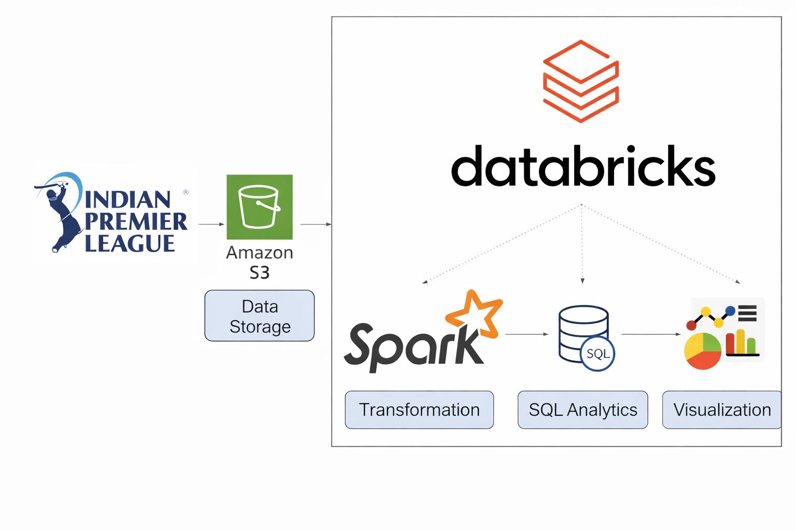

# IPL Data Analysis: PySpark & Databricks ETL

## *🚀 Project Overview*
Developed a modular, end-to-end Apache Spark ETL pipeline designed to process and transform large-scale IPL cricket datasets. The project emphasizes **production-grade** practices, including explicit schema enforcement, decoupled transformation logic, and Spark SQL optimization.

## *🛠️ Data Engineering Tech Stack*
**Engine**: Apache Spark (PySpark & Spark SQL)  
**Platform**: Databricks (Unified Analytics Platform)  
**Storage**: AWS S3 (Data Lake Ingestion)  
**Orchestration**: Modular Python Design  
**Graphs**: Matplotlib & Seaborn for reporting

## *🏗️ Engineering Architecture & Design Patterns*
* **Modular Architecture**: Logic is decoupled into modules:  
     * **schemas.py**: Centralized metadata and StructType definitions.  
     * **transformations.py**: Pure, idempotent PySpark functions for data cleaning.  
    * **sql_queries.py**: Business logic encapsulated in Spark SQL.  
    * **main.py**: The entry-point script that orchestrates the E-T-L flow.

* **Medallion-Style Logic**: Data flows from Raw (S3) through a Transformation layer to a refined "Gold" output layer.

## *⚡ Technical Highlights & Optimization*
* **Explicit Schema Enforcement**: Avoided `inferSchema=True` to eliminate the overhead of an extra Spark job and to ensure ***Type Safety*** across 5+ granular datasets.

* **Window Function Optimization**: Implemented partitioned windowing (e.g., `Window.partitionBy("match_id").orderBy("over")`) to calculate cumulative metrics without triggering expensive global shuffles.

* **Shuffle & Partition Management**: Used `coalesce(1)` for final write-out to solve the "Small File Problem" and ensure the output is optimized for downstream reporting tools.

* **Lazy Evaluation Strategy**: Structured transformations to take full advantage of the ***Catalyst Optimizer*** by grouping narrow transformations before wide transformations.

## *🔄 Transformations*
* **Schema Standardization**: Applied `regexp_replace` and `to_date` to handle heterogeneous date formats across multiple seasons.

* **Date & Boolean Normalization**: Converted different formats of date into uniform format and integer-based flags (0/1) to proper Boolean types hence improving data readability and storage efficiency.

* **Complex Joins**: Optimized multi-way joins between Ball-by-Ball and Match metadata using explicit aliasing.

## *📂 Repository Structure*  
├── main.py &nbsp; &nbsp; &nbsp; &nbsp; &nbsp; &nbsp; &nbsp; &nbsp; &nbsp; &nbsp; &nbsp; &nbsp; # Orchestrator: Initializes Spark and executes the pipeline  
├── src/ &nbsp; &nbsp; &nbsp; &nbsp; &nbsp; &nbsp; &nbsp; &nbsp; &nbsp; &nbsp; &nbsp; &nbsp; &nbsp; &nbsp; &nbsp; # Core Engineering Logic  
│   ├── schemas.py &nbsp; &nbsp; &nbsp; &nbsp; &nbsp; &nbsp; &nbsp; # StructType definitions for schema enforcement  
│   ├── transformations.py &nbsp; # Reusable PySpark cleaning & processing functions  
│   └── sql_queries.py  &nbsp; &nbsp; &nbsp; &nbsp; &nbsp;# Analytical logic written in optimized Spark SQL  
├── notebooks/  
│   └── EDA_Visuals.ipynb     &nbsp; # Visual reporting layer  
├── requirements.txt  &nbsp; &nbsp; &nbsp; &nbsp;# Project dependencies  
└── README.md &nbsp; &nbsp; &nbsp; &nbsp; &nbsp; &nbsp; &nbsp;# Technical documentation  

## *✅ Key Engineering Learnings*
* **Scalability**: How to design pipelines that handle 800k+ records without OOM errors.

* **Decoupling**: Why separating schema from logic is essential for production CI/CD. 

* **Data Consistency**: Built custom logic to normalize heterogeneous date formats and handle type-checking for robust ETL. 
 
* **Storage Optimization**: Applied `coalesce` operations to manage file output and ensure clean, single-file delivery of reports.

<h2 align="center">IPL Data Engineering Pipeline Architecture</h2>

  

 
